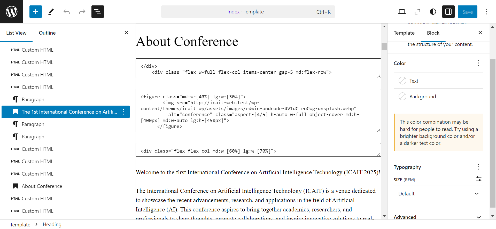
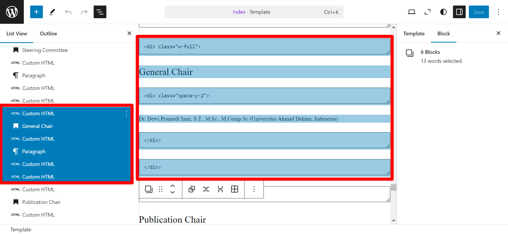

### Run Local Development

1. change directory to `wp-themes`
2. run `git clone https://github.com/haniframadhani/icait_wp.git`
3. change directory to `icait-wp`
4. run `npm install`
5. run `npm run watch`
6. active the theme

### Run on live wordpress

1. download zip file from release
2. open your wordpress dashboard
3. navigate to appearance > themes
4. click `add new theme` button
5. click `upload theme` button
6. upload the zip file
7. click `install now` button
8. click `active`

### customize content

**NOTE**

to customize content in hero section and another section can be done in `edit site` in [wordpress admin bar](https://wordpress.com/support/admin-bar/).

#### navigation / menu

navigation / menu content can be change in appearance > menus. Don't change the navigation / menu in `edit site`

#### upload image {#upload-image}

to upload image you can follow this step

1. open media menu from sidebar
2. click `add new media file`
3. upload the image you want to use
4. after the image uploaded click the image
5. in the image detail on the right side scroll down to find the image url and copy it by click the `Copy URL to clipboard` button
   
   

#### install plugin {#install-plugin}

to install image you can follow this step

1. open plugins menu from sidebar
2. click `add new plugin`
3. search plugin you want to use
4. click `install` button on plugin you want to use
5. after installation done click `active` button to activated the plugin
   
   

#### hero section


hero section may look like in the picture with empty part between the html block. the text color and the background color almost have same color that make the empty part.

to edit the text you can write somewhere else and copy then paste it to part you want to edit the text.

#### about section

to edit text in about section you can edit it like usual.

to edit the image you need to upload your image in media menu then copy the image url and change the `src=""` in custom html block. to upload image see [upload image](#upload-image)


#### speaker section

to edit text in about section you can edit it like usual.

to edit the image you need to upload your image in media menu then copy the image url and change the `src=""` in custom html block. to upload image see [upload image](#upload-image)


to add more speaker you can duplicate the part shown in image below sequencially

and must duplicate between part shown in image below


#### call for paper section

to edit text in about section you can edit it like usual. to add more list can be done by simply duplicate the list item and change the text in list item


#### for author section

to edit text in about section you can edit it like usual. to edit the timeline text can edit like other text.

to add more time can be done with duplicate the list item


**note**

this code is the line connect between dot

```html
<div
  class="left-7.5 absolute top-0.5 h-full w-px -translate-x-1/2 translate-y-2 bg-san-juan-700"
></div>
```


this code is the dot

```html
<div
  class="left-0 flex size-3 flex-shrink-0 flex-grow-0 flex-col rounded-full bg-san-juan-700 md:left-[30px]"
></div>
```


#### committee section

to edit text in about section you can edit it like usual. to add more committee member can just duplicate the paragraph. to add more committee group can be done with duplicate the part shown in the image below sequencially

and must duplicate between part shown in image below


#### registration section

to edit text in about section you can edit it like usual. to add table can use table plugin like [wpDataTables](https://wordpress.org/plugins/wpdatatables/). to install plugin see [install plugin](#install-plugin). to add table you need to add between the custom html as the image shown


#### footer section

to edit text in about section you can edit it like usual.
to change the icon you can change the `data-lucide=""` with the icon name you want to use in [lucide icon](https://lucide.dev/icons/)

to edit the link label you can change the text between the `<a>` and `</a>`. to edit the link destination you can change the `href=""`. `mailto:` is use to open the email program. `tel:`is use to open the phone program
